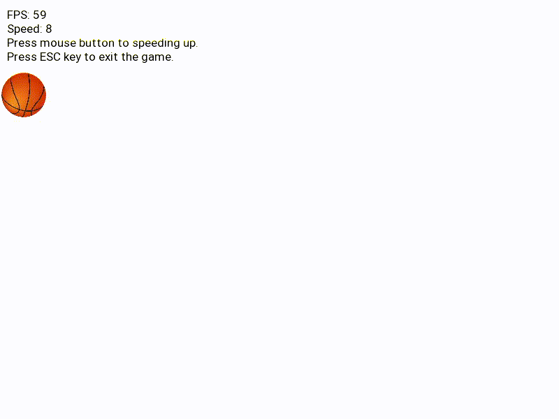

# Nonstop Ball



Let me tell you up front, this is not a fun game at all. This is just an exercise.

But anyway here is the Nonstop Ball! Written in C++ and SFML.

C++ version: 
```bash
$ g++ --version
g++ (Ubuntu 9.4.0-1ubuntu1~20.04.1) 9.4.0
```
SFML 2.5.1 version from [https://www.sfml-dev.org/download.php](https://www.sfml-dev.org/download.php).

